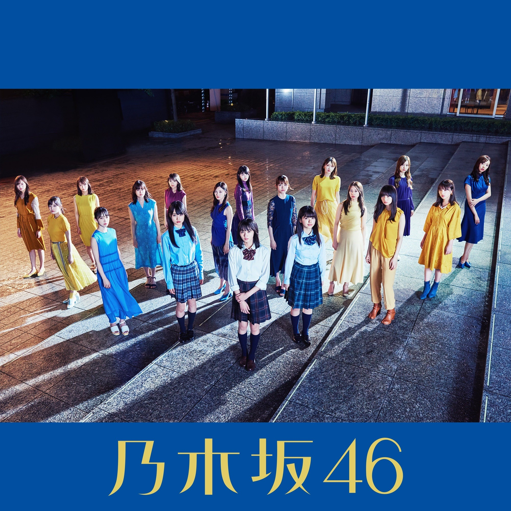

# Format

- MP3/320/CD

# Playlist

1. Yoakemade Tsuyogaranakutemoii
2. - (Type-A) 路面電車の街 (Romendensha no Machi)
   - (Type-B) Toshoshitsu no Kimi e (図書室の君へ) - 4th Generation
   - (Type-C) 時々 思い出してください (Tokidoki Omoidashite Kudasai)
   - (Type-D) ～ Do my best ～じゃ意味はない (~Do my best~ Ja Imi wa Nai)
3. Yoakemade Tsuyogaranakutemoii (off vocal ver.)
4. - (Type-A) 路面電車の街 (Romendensha no Machi) (off vocal ver.)
   - (Type-B) Toshoshitsu no Kimi e (図書室の君へ) - 4th Generation (off vocal ver.)
   - (Type-C) 時々 思い出してください (Tokidoki Omoidashite Kudasai) (off vocal ver.)
   - (Type-D) ～ Do my best ～じゃ意味はない (~Do my best~ Ja Imi wa Nai) (off vocal ver.)
