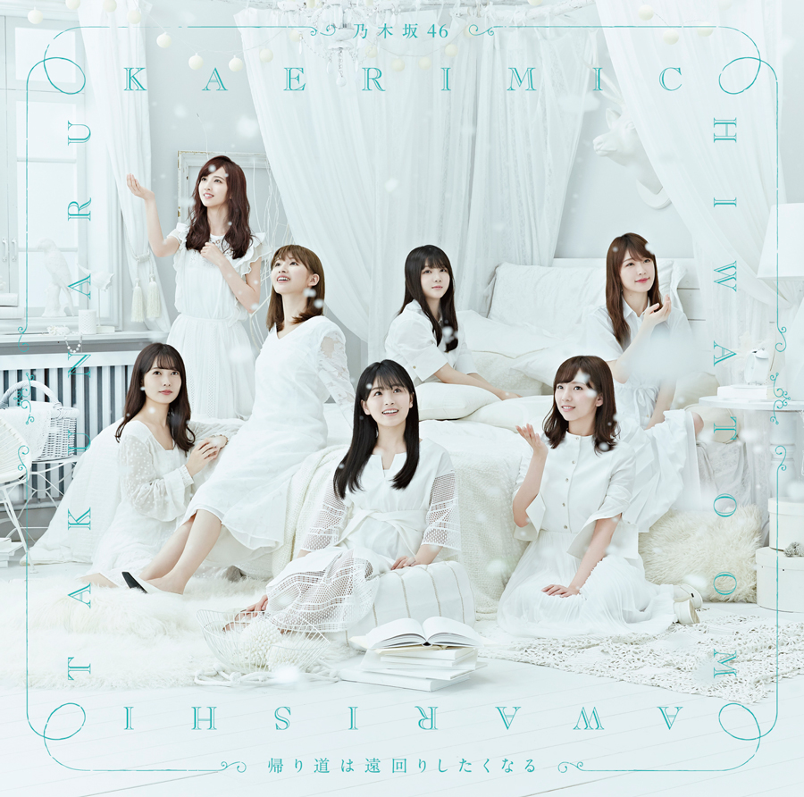

# Format

- MP3/320/CD

# Playlist

1. Kaerimichi wa Toomawari Shitaku Naru
2. - (Type-A) Tsuzuku (つづく)
   - (Type-B) Nichijou (日常)
   - (Type-C) Kokuhaku no Junban (告白の順番)
   - (Type-D) Chopin no Usotsuki (ショパンの嘘つき)
3. Kaerimichi wa Toomawari Shitaku Naru (off vocal ver.)
4. - (Type-A) Tsuzuku (つづく) (off vocal ver.)
   - (Type-B) Nichijou (日常) (off vocal ver.)
   - (Type-C) Kokuhaku no Junban (告白の順番) (off vocal ver.)
   - (Type-D) Chopin no Usotsuki (ショパンの嘘つき) (off vocal ver.)
