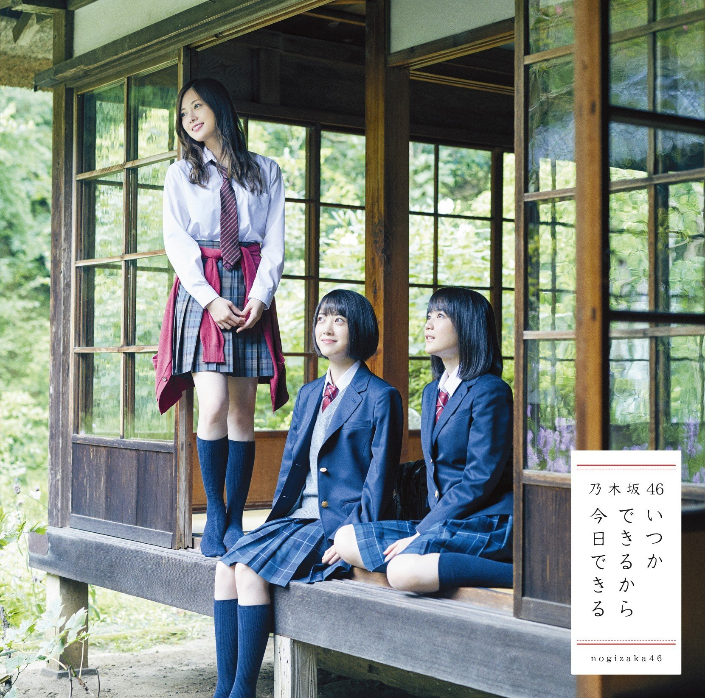

# Format

- MP3/320/CD

# Playlist

1. Itsuka Dekiru Kara Kyou Dekiru
2. - (Type-A) Maa ii ka? (まあいいか？)
   - (Type-B) Shitsuren wo Shoji Hito (失恋お掃除人)
   - (Type-C) My Rule
   - (Type-D) Boku no Shoudou (僕の衝動)
3. Dekiru Kara Kyou Dekiru (off vocal ver.)
4. - (Type-A) Maa ii ka? (まあいいか？) (off vocal ver.)
   - (Type-B) Shitsuren wo Shoji Hito (失恋お掃除人) (off vocal ver.)
   - (Type-C) My Rule (off vocal ver.)
   - (Type-D) Boku no Shoudou (僕の衝動) (off vocal ver.)
