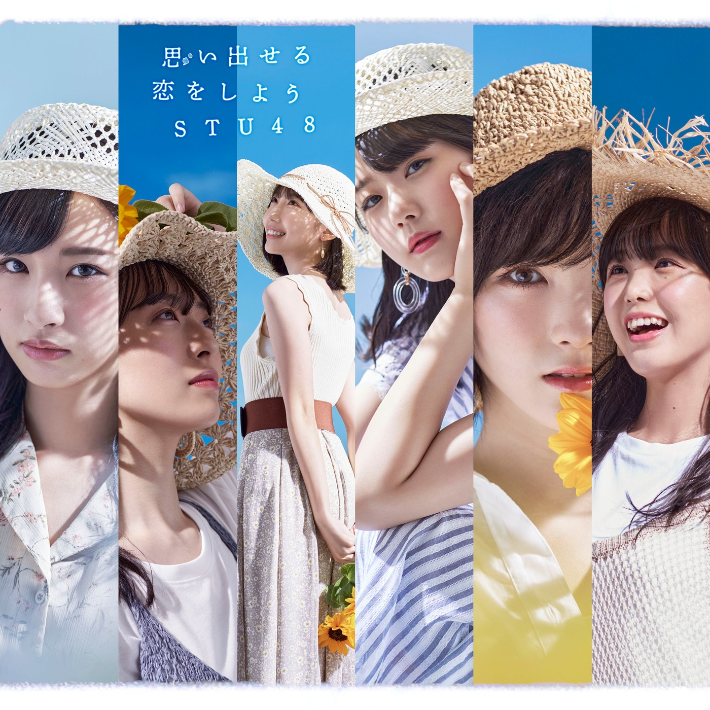

### Format
- FLAC / 16Bit

### Playlist
#### Type-A
01. Omoidaseru Koi wo Shiyou (思い出せる恋をしよう) / Senbatsu (STU ver.)
02. Omoidaseru Koi wo Shiyou (思い出せる恋をしよう) / Senbatsu (Kenkyuusei 2nd Generation ver.)
03. Seishun Kakueki Teisha (青春各駅停車) / Aoi Himawari (青い向日葵)
04. Omoidaseru Koi wo Shiyou (off-vocal)
05. Seishun Kakueki Teisha (off-vocal)
#### Type-B
01. Omoidaseru Koi wo Shiyou (思い出せる恋をしよう) / Senbatsu (STU ver.)
02. Omoidaseru Koi wo Shiyou (思い出せる恋をしよう) / Senbatsu (Kenkyuusei 2nd Generation ver.)
03. (Type-B) Ano Hi Kara Boku wa Kawatta (あの日から僕は変わった) / Takino Yumiko, Tanaka Kouko, Nakamura Mai, Yabushita Fu
04. Omoidaseru Koi wo Shiyou (off-vocal)
05. (Type-B) Ano Hi Kara Boku wa Kawatta (off-vocal)