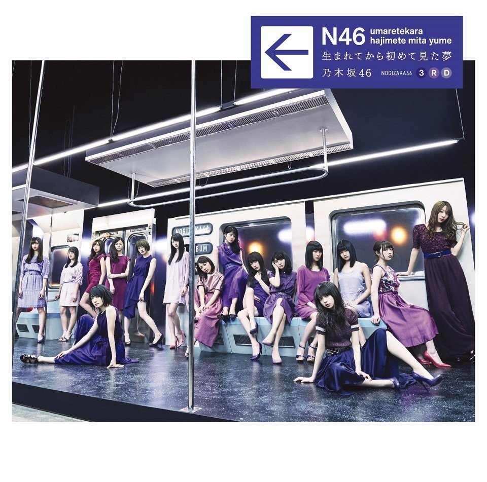

# Format

- MP3/320/CD

# Playlist

1. [ FP ] Kimi ga Aoide Kureta (君が扇いでくれた)
2. [ A ] Rewind Ano Hi (Rewind あの日)
3. [ B ] Katai Kara no You ni Dakishimetai (硬い殻のように抱きしめたい)
4. [ RE ] Ryuusei Discotech (流星ディスコティック)
