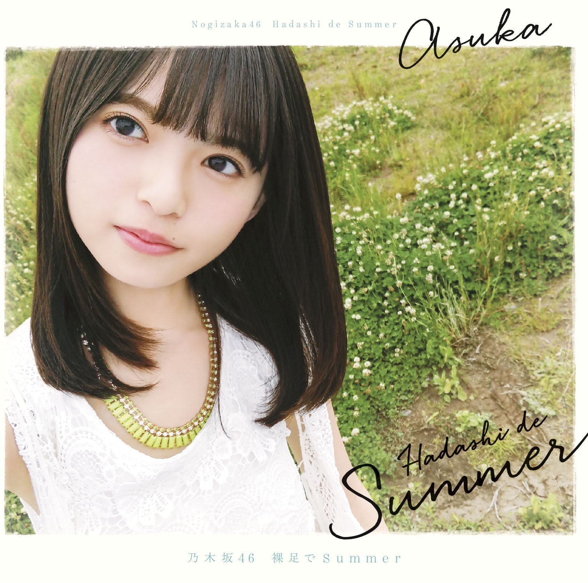

# Format

- MP3/320/CD

# Playlist

1. Hadashi de Summer
2. - (Type-A)「オフショアガール」
   - (Type-B)「林檎売りとカメムシ」
   - (Type-C)「白米様」
   - (Type-D)「シークレットグラフィティー」
3. Hadashi de Summer (off vocal ver.)
4. - (Type-A)「オフショアガール」(off vocal ver.)
   - (Type-B)「林檎売りとカメムシ」(off vocal ver.)
   - (Type-C)「白米様」(off vocal ver.)
   - (Type-D)「シークレットグラフィティー」(off vocal ver.)
